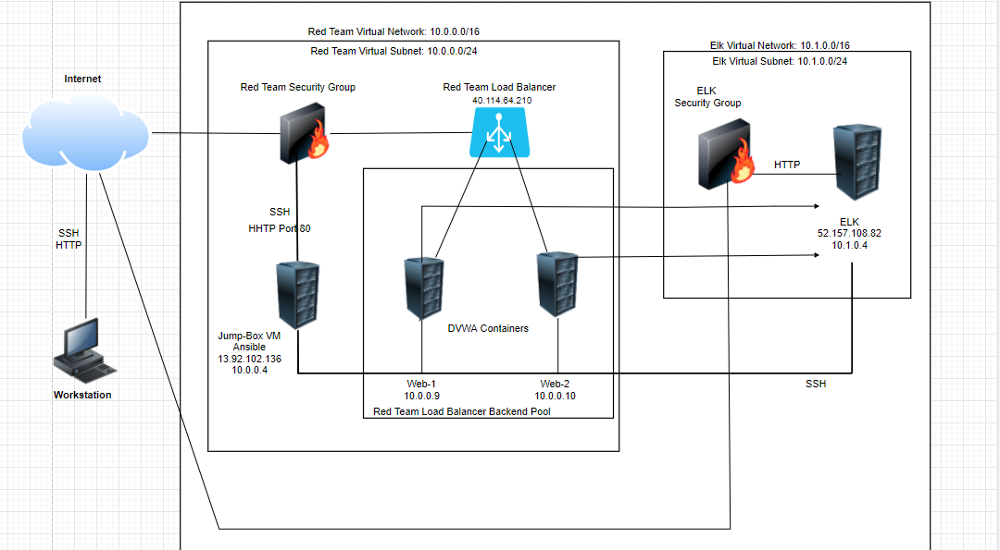
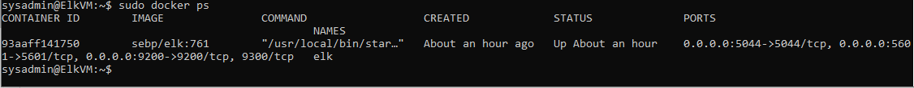

## Automated ELK Stack Deployment

The files in this repository were used to configure the network depicted below.



These files have been tested and used to generate a live ELK deployment on Azure. They can be used to either recreate the entire deployment pictured above. Alternatively, select portions of the PLAYBOOK file may be used to install only certain pieces of it, such as Filebeat.

  
  ```
  ---
- name: installing and launching filebeat
  hosts: webservers
  become: yes
  tasks:

  - name: download filebeat deb
    command: curl -L -O https://artifacts.elastic.co/downloads/beats/filebeat/filebeat-7.6.1-amd64.deb


  - name: install filebeat deb
    command: dpkg -i filebeat-7.6.1-amd64.deb

  - name: drop in filebeat.yml
    copy:
      src: /etc/ansible/files/filebeat-config.yml
      dest: /etc/filebeat/filebeat.yml

  - name: enable and configure system module
    command: filebeat modules enable system

  - name: setup filebeat
    command: filebeat setup

  - name: start filebeat service
    command: service filebeat start

  - name: enable service filebeat on boot
    systemd:
      name: filebeat
      enabled: yes
  ```

This document contains the following details:
- Description of the Topology
- Access Policies
- ELK Configuration
  - Beats in Use
  - Machines Being Monitored
- How to Use the Ansible Build


### Description of the Topology

The main purpose of this network is to expose a load-balanced and monitored instance of DVWA, the D*mn Vulnerable Web Application.

Load balancing ensures that the application will be highly _AVAILABLE_, in addition to restricting _ACCESS_ to the network.
- _What aspect of security do load balancers protect?_ AVAILABILITY 
- _What is the advantage of a jump box?_ Protecting Webserver 1 & Webserver 2 from unauthorized SSH login attempts

Integrating an ELK server allows users to easily monitor the vulnerable VMs for changes to the CONFIGURATION and system USAGE.
- _What does Filebeat watch for?_ Changes in the files
- _What does Metricbeat record?_ System and service metrics

The configuration details of each machine may be found below.
_Note: Use the [Markdown Table Generator](http://www.tablesgenerator.com/markdown_tables) to add/remove values from the table_.

| Name     | Function | IP Address | Operating System |
|----------|----------|------------|------------------|
| Jump Box | Gateway    | 10.0.0.4  | Linux            |
| Web 1    | Web Server | 10.0.0.9  | Linux                 |
| Web 2    | Web Server | 10.0.0.10 | Linux                 |
| Elk      | Centralized Logging | 10.1.0.4  | Linux  


### Access Policies

The machines on the internal network are not exposed to the public Internet. 

Only the Jump Box machine can accept connections from the Internet. Access to this machine is only allowed from the following IP addresses:
- 67.87.160.237 

Machines within the network can only be accessed by the Jump Box.
- _Which machine did you allow to access your ELK VM? What was its IP address?_
  
  67.87.160.237

A summary of the access policies in place can be found in the table below.

|     Name     | Publicly Accessible | Allowed IP Addresses |
|:------------:|---------------------|----------------------|
| Jump Box     | Yes                 | 67.87.160.237        |
| Web Server 1 | No                  | 10.0.0.9                     |
| Web Server 2 | No                  | 10.0.0.10                     |
| Elk Server   | No                 |  10.1.0.4        |

### Elk Configuration

Ansible was used to automate configuration of the ELK machine. No configuration was performed manually, which is advantageous because...
- What is the main advantage of automating configuration with Ansible?
  
  The ability to perform administrative tasks in a single task, instead of having to update each server individually. 

The playbook implements the following tasks:

In 3-5 bullets, explain the steps of the ELK installation play. E.g., install Docker; download image; etc...
- Install Docker
- Download Image
- Install Python-3-pip
- Increase Virtual Memory
- Dowload and Launch a Docker Elk Container

The following screenshot displays the result of running `docker ps` after successfully configuring the ELK instance.



### Target Machines & Beats
This ELK server is configured to monitor the following machines:
- 10.0.0.9
- 10.0.0.10

We have installed the following Beats on these machines:
- Filebeat

These Beats allow us to collect the following information from each machine:

In 1-2 sentences, explain what kind of data each beat collects, and provide 1 example of what you expect to see. 
- Filebeat monitors or logs specified files, collects log events and forwards them to Elk Stack. Filebeat can also be used to parse and visualize data.
  
### Using the Playbook
In order to use the playbook, you will need to have an Ansible control node already configured. Assuming you have such a control node provisioned: 

SSH into the control node and follow the steps below:
- Copy the Playbooks to the Ansible Control Node.
- Update the /etc/ansible/hosts file to include Webserver 1, Webserver 2 and the Elk machine. 
- Run the playbook, and navigate to Kibana to check that the installation worked as expected.

_Answer the following questions to fill in the blanks:_
- Which file is the playbook? yml 
- Where do you copy it? To the /etc/ansible file
- Which file do you update to make Ansible run the playbook on a specific machine? How do I specify which machine to install the ELK server on versus which to install Filebeat on?_ It is specified in the hosts file Under Webservers and or Elk. 
- Which URL do you navigate to in order to check that the ELK server is running? http://www.52.157.108.82:5601/setup.php

_As a **Bonus**, provide the specific commands the user will need to run to download the playbook, update the files, etc._

- Command to Restart: systemctl restart ssh
- Command to see all installed services: 
  systemctl list-units  --type=service